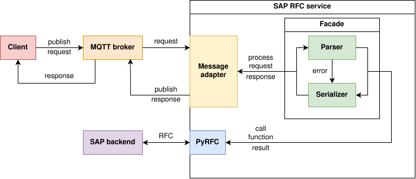

[](https://www.python.org/downloads/)
[](https://opensource.org/licenses/MIT)

# SAP RFC via MQTT

A microservice for making SAP RFC via MQTT messages.

The component diagram of the system:



The message adapter, parser, and serializer abstractions allow for
the messaging protocol, message format, and response format
to be easily replaced independently from other parts of the service.

## Installation

Install [PyRFC](https://github.com/SAP/PyRFC).

Install service dependencies:
```
pip install -r requirements.txt
```
Set the required environment variables, for example, see [test environment](tests/.env).

Start service:
```
python sap_rfc_via_mqtt/main.py
```

## Testing

Create the virtual environment:
```
python -m venv .venv
. .venv/bin/activate
pip install --upgrade pip
pip install -r requirements.txt -r requirements-testing.txt
```

For testing MQTT communication, clone [Paho Testing Utilities](https://github.com/eclipse/paho.mqtt.testing):
```
git clone https://github.com/eclipse/paho.mqtt.testing.git
```
Run the tests:
```
pytest tests -v
```
